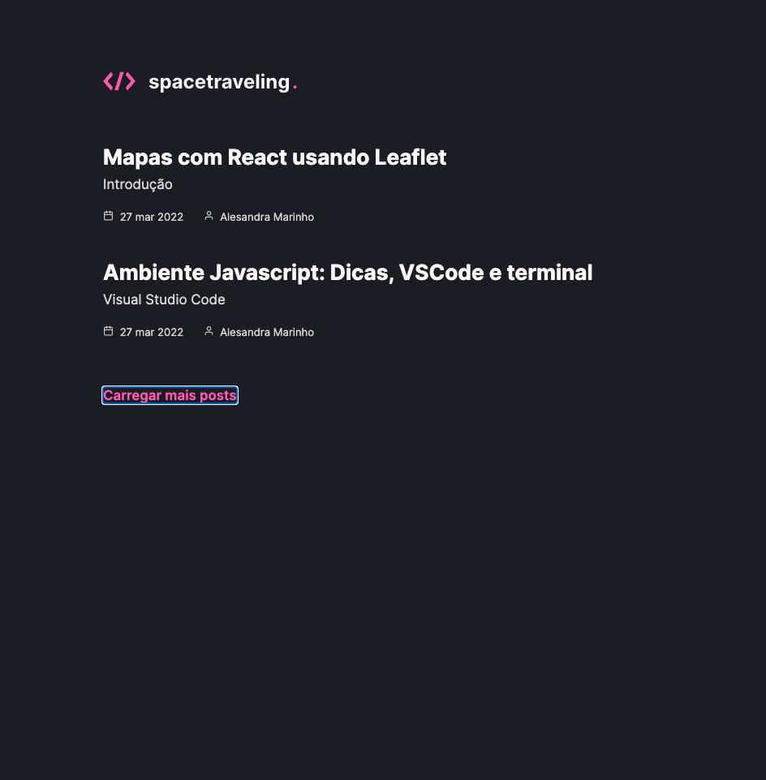
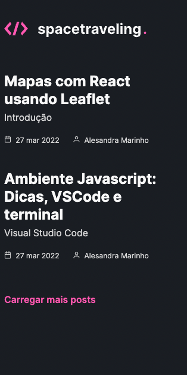

# ignite-reactjs-criando-um-projeto-do-zero

## Sobre o Desafio ##

Criar um blog do zero e deve consumir os dados do Prismic e ter a interface implementada conforme o layout do Figma. Implementar:

- Estilizações global, comun e individuais;
- Importação de fontes Google;
- Paginação de posts;
- Cálculo de tempo estimado de leitura do post;
- Geração de páginas estáticas com os métodos `getStaticProps` e `getStaticPaths`;
- Formatação de datas com `date-fns`;
- Uso de ícones com `react-icons`;
- Requisições HTTP com `fetch`;
- Entre outros.

<h2>Tecnologias 💻 </h2>

HTML5 - SASS - ReactJS - NextJS - TypeScript
Modelo responsivo.

<h2>Layout Mobile e Desktop</h2>

      
      

